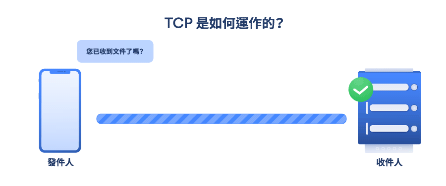
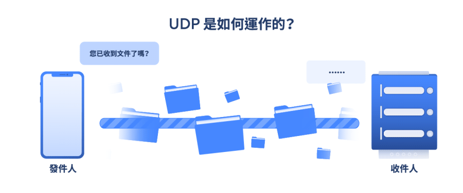

# HTTP

全名為 [超文本傳輸協定（HyperText Transfer Protocol](https://zh.wikipedia.org/wiki/%E8%B6%85%E6%96%87%E6%9C%AC%E4%BC%A0%E8%BE%93%E5%8D%8F%E8%AE%AE))，用來規範 `客戶端` 與 `服務端` 之間的傳輸協定，所有的 `WWW` 檔案都必須遵守這個標準。

## 無狀態協議

`服務端` 不保存 `客戶端` 過來的任何資料，每次的 **請求** 發送都是無差別的，`服務端` 的需求，每次 **請求** 都要發送一次；但後續為了實現保持狀態的功能，在 HTTP/1.1 引入了 `cookie` 技術，

`HTTP` 本身是**無狀態協議**，這是為了更快處理大量數據傳輸。

:::tip
 - 優點：每次請求不保存資料，`服務端` 不會造成不必要的佔用。
 - 缺點：每次請求都會有大量的重復數據傳輸。
:::

:::tip 有狀態
在 `服務端` 保留之前請求的資料，用來處理 現在 (當前) 的請求。(比如：`session` )
:::

## 請求方法

|方法|描述|
|:-:|-|
| GET | 取得資料 |
| POST | 新增資源 (提交指定資源的實體，讓 `服務端` 處理，通常會改變 `服務端` 的狀態) |
| PATCH | 指定資源的部分修改 |
| PUT | 替換資源 |
| DELETE | 刪除指定資源 |

:::tip PUT 與 PATCH 的差別
- PUT 是替換掉 **整筆資料**
- PATCH 是修改 **部分** 的欄位
:::

## 狀態碼
使用數字格式來告之 `客戶端` 請求的結果，會顯示於回應後的 `Status Code`，分為五種：
- **1xx 資訊回應**
  - `100 Continue` 目前為止的一切完好，用戶端應該繼續完成請求，或當請求已經完成的狀態下應忽略此訊息。
- **2xx 成功回應**
  - `200 OK` 請求成功
  - `201 Created` 請求成功，且新的資料被創建，通常用於 `POST`、`PUT` 方法
- **3xx 重定向**
  - `301 Moved Permanently` 請求資源的 URL 被永久改變，未來 `用戶端` 使用此 URL 應導向回應的指定 URL。

- **4xx `客戶端` 錯誤**
  - `400 Bad Request` 錯誤的請求內容，`服務端` 無法理解請求。
  - `401 Unauthorized` 請求未授權，是可以再通過驗証通過 (`服務端` 不知道使用者身份)。
  - `403 Forbidden` 請求被拒絕，用戶端無訪問權限，不同於 `401` 是 `服務端` 知道用戶的身份。
  - `404 Not Found` 找不到請求的資源
- **5xx `服務端`錯誤** 
  - `500 Internal Server Error` `服務端` 執行請求時發生錯誤。 

## HTTP HTTPS 層級顯示

## 傳輸層 (TCP / UDP)

[TCP]（通訊控制協定）和 UDP（用戶資料包協定）都是網際網路中常見的協定，它們負責在網際網路將資料從設備傳輸到伺服器。當您使用 Skype 聊天、發送電子郵件、觀看直播或瀏覽網頁時，都會使用這兩種協定。

UDP 和 TCP 都會將資料分隔成更小的單元進行傳輸。這些小單元稱為封包，封包中包含發送端和接收端的 IP 位址、各種配置、使用者傳送的實際資料等。

### TCP
[TCP]:/Browser/tcp.md
[TCP] 是網際網路上最常用的協定，這種協定較為可靠，運作方法如下：

1. [TCP] 為每個封包分配一個唯一的識別碼和一個序號，這些號碼能讓接收端識別封包的完整性，以及封包的順序。
2. 當接收端收到封包後，如果順序正確，會向發送端傳送一個確認信號（Acknowledgement），以此確認接收端已經收到封包。
3. 發送端傳送另一個封包。
4. 如果封包遺失或發送順序錯誤，接收端會保持沈默，不發送確認信號。這表示發送端需要重新傳送封包。

:::tip
因為資料是按照順序發送的，有助於流量控制和解決資料壅塞的問題，並容易發現和修復錯誤。因此，經由 TCP 發送的資料能完全到達目的地。即使網路阻塞，傳輸的資料也不會出問題。不過 TCP 也有缺點，發送端和接收端之間有很多往來的通訊，因此建立連線和交換資料需要更多的時間。
:::

### UDP

不需要唯一識別碼和序號就能完成相同的工作。這種協定以串流方式傳送資料，發送端不會等待接收端的確認信號，會繼續不斷發送封包資料。UDP 幾乎沒有錯誤修正功能，也不在乎封包遺失，因此很容易出錯，但傳輸速度比 TCP 更快。串流媒體、VoIP 語音、網路遊戲等服務經常使用 UDP 協定，這網路應用不太需要可靠性機制，封包遺失不會導致服務中斷。

### 差異
|＼|TCP|UDP|
|-|-|-|
|可靠度|可靠|不可靠|
|速度	|慢|快|
|數據順序|保証|不保証|
|數據正確|保証|不保証|
|系統資源|要求|不要求|
|擁塞控制|有|無|
|應用實例|收送電子郵件、遠程登錄|即時通訊、在線視頻、語音電話|
## Reference
- [HTTP 指南](https://halfrost.com/http/)
- [HTTP 狀態碼](https://developer.mozilla.org/zh-TW/docs/Web/HTTP/Status)
- [使用 Laravel 打造 RESTful API系列 第 8 篇](https://ithelp.ithome.com.tw/articles/10217459)
- [TCP 和 UDP 是什麼：簡單的說明](https://nordvpn.com/zh-tw/blog/tcp-udp-bijiao/)