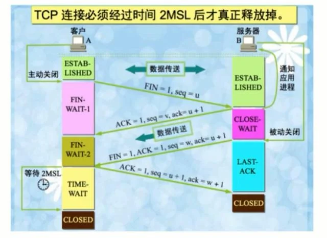

# TCP 傳輸控制協定

是一種主機之間互連線並傳輸資料通訊規範，它在主機之間建立並維護虛擬連線，直到交換了一條訊息或要在其上執行的應用程式交換的訊息為止。`資料包` 是TCP/IP網路上資料傳輸的最基本單位。

## 運作方式 

- 連線建立 (三次握手)
- 資料傳送
- 連線終止 (四次揮手)

## 連線建立 ([三次握手](https://notfalse.net/7/three-way-handshake))

目的是在確認雙方的 **接收** 、 **發送** 能力是否正常，為之後的傳送做準備。

- **第一次握手** 建立連線時， `客戶端` 發送 SYN (同步序號)包給 `服務器端` 確認
- **第二次握手** `服務器端` 確認 `客戶端` 的 SYN 包，同時自已會會發送一包  (SYN + ACK ) 給 `客戶端` ( `服務器端` 進入 `SYN_RECV` 即等待請求 )
- **第三次握手** `客戶端` 收到包後，發送 ACK 包給 `服務器端` ，發送完畢就確認了已連線的狀態。就可以開始 req res 傳送資料。

## [資料傳送](https://www.notion.so/TCP-UDP-bf9c94194cd042668c45d61393736b69)

資料被傳送時，通常會拆分為很多個小包(封包)

:::tip 💡 
TCP為了保證不發生丟包的情況，就給每個包一個序號，同時序號也保證了傳送到接收端實體的包的按序接收。接收端實體對已成功收到的包發回一個相應的確認資訊（ACK），如果傳送端實體在合理的往返時延（RTT）內未收到確認，那麼對應的資料包就被假設為已丟失並進行重傳。
:::

- 客戶端確認順序與識別碼後，回傳確認信

## 連線終止 (四次揮手)

我們分手吧 > 啥? > 你確定? > 是的 (斷開)

- 第一次
    
    `客戶端` 向 `服務端` 發起 **斷開請求** 同時會傳送數據。 `客戶端` 就會進入 `FIN_WAIT-1` 狀態
    
    (這個時候 `客戶端`不能發送數據，只能接收數據、應答數據)
    
- 第二次
    
    `服務端` 收到斷開請求後，回復 `客戶端` 已經接收到，同時發送數據；這時 `服務端` 會進入 `close-wait` 狀態；而 `客戶端` 接收回應後 進入  `FIN_WAIT-2` 狀態
    
- 第三次
    
    `服務端` 確認傳輸到 `客戶端` 的數據已經結束後，就會向 `客戶端` 發送連線斷開請求，且傳送數據，進入 `LAST-ACK` 狀態
    
- 第四次
    
    `客戶端` 收到斷開請求後，回覆斷開請求數據，進入 `TIME-WAIT` 狀態； `服務端`  在收到請求後 進入 `CLOSED` 狀態，立即斷開。
    

### 為什麼需要四次?

`TCP` 是雙工，這是為了確保雙方都接收到要中斷的請求。

## Reference
- [面试官，不要再问我三次握手和四次挥手](https://juejin.cn/post/6844903958624878606)