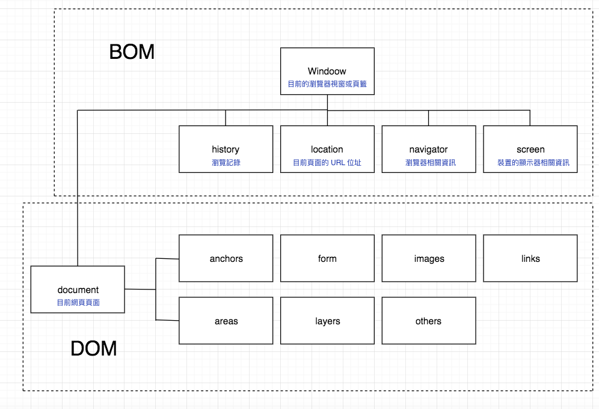

# BOM

:::tip 簡單說
- **ECMAScript 標準裡的「全域物件」 (Global Object)**
- **JavaScript 用來與瀏覽器溝通的窗口**
:::


## 說明
BOM (Browser Object Model) 瀏覽器物件模型，是瀏覽器所有功能的核心，開發者可以透過 `Javascript` 操作 `BOM API` 去跟瀏覽器做溝通。

`BOM` 主要指的就是 `window` 物件，是所有瀏覽器中的最上層、同時也是 「全域物件」。
而 `window` 提供的屬性主要為 `document`、`location`、`navigator`、`screen`、`history` 都是常用的功能。

## 常用操作

### 擷取特性
|方式|說明|
|-|-|
|window.innerHeight|視窗高度|
|window.innerWidth|視窗寬度|
|window.screenX	|滑鼠x座標|
|window.screenY	|滑鼠y座標|
|window.location | 目前頁面 URL|
|window.history	| 擷取覽器視窗或頁籤的瀏覽紀錄|
|window.history.length |	`history` 物件中瀏覽記錄的筆數|
|window.screen.width | 擷取目前頁面寬度|
|window.screen.height | 擷取目前頁面高度|

### 操作方法
|方法|說明|回傳|
|-|-|-|
|window.alert( string ) |	彈出信息	| |
|window.open( URL ) |	另開啟視窗到...	| |
|window.print()	| 開啟列印功能	| |
|prompt( string )	 | 問答視窗，可得到回填文字	| |
|confirm( string )	| 確認視窗，只有 true || false	| |
|setTimeout( function, second) |	(計時) 倒數後執行 (一次) |	計時器 id；取消 `cleanTimeout( id )`|
|setInterval( function, second ) |	(計時) 倒數後執行 (無限)	| 計時器 id；取消 `cleanInterval( id )` |
|window.scroll()		| 滾動視窗 |  |


### 視窗平滑滾動

```javascript
window.scroll({
  top: 0,
  left: 0,
  behavior: 'smooth',
})
```

### Reference
- [happycoding](https://www.happycoding.today/posts/43)