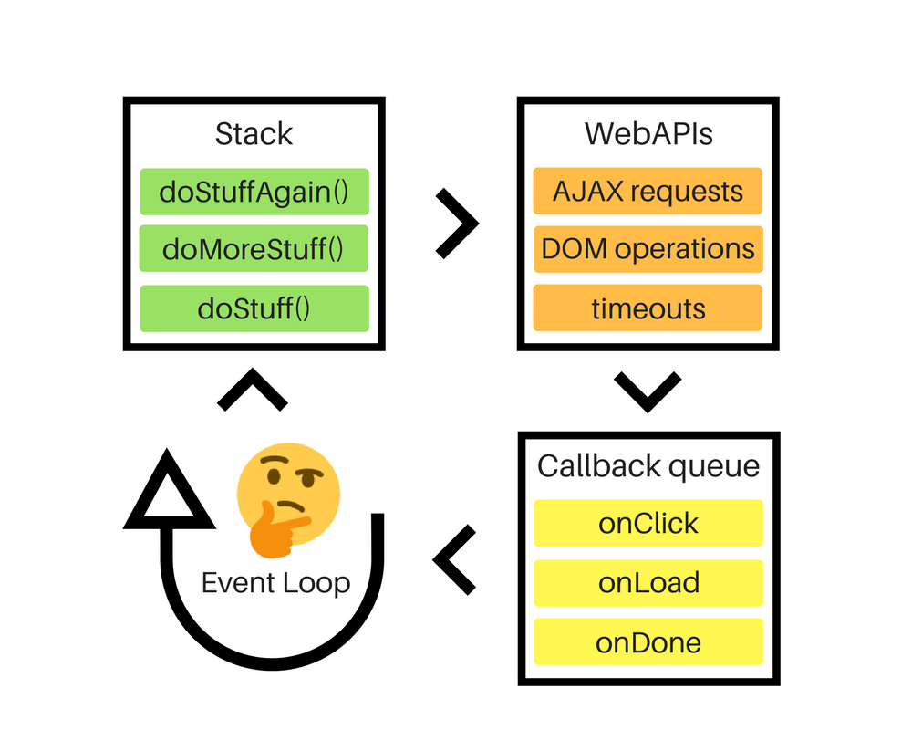

# Event Loop 事件循環

## 說明

`Javascript` 為 **單一執行緒** ，程式是一行一行向下執行 「 同一時間，只能執行一段程式碼 」，等上一件事做完才會執行下一件事。而 `Event Loop` 可以讓 `Javascript` 絕不阻塞!

## 流程

- **Stack** (同步函式推疊)：

  當程式跑到什麼位子，就會把執行函式丟進這個區塊，且上堆疊。(後進先出)

- **WebAPIs** (非同步函式區塊)

  為了避免執行被阻塞住，**Stack** 中，如果執的行函式是屬於 `DOM 操作` 、 `非同步 (AJAX、AXIOS)` 、`setTimeout`，就會被 **移動** 到 WebAPIs 區塊，同時執行 **非同步** 行為。(先進先出)

- **Call Queue** (非同步執行結果區塊)

  **WebAPIs** 非同步執行的結果，就會先被放在 **Call Queue** 區塊，依序排隊。
  當 **Stack** 堆疊的函式全部執行完成，就會開始執行 **Call Queue** 區塊內部函式 (先進先出)。

<iframe width="560" height="315" src="https://www.youtube.com/embed/N0Au8yc5IOw" title="YouTube video player" frameborder="0" allow="accelerometer; autoplay; clipboard-write; encrypted-media; gyroscope; picture-in-picture" allowfullscreen></iframe>

## Reference

- [線上工具](http://latentflip.com/loupe/?code=JC5vbignYnV0dG9uJywgJ2NsaWNrJywgZnVuY3Rpb24gb25DbGljaygpIHsKICAgIHNldFRpbWVvdXQoZnVuY3Rpb24gdGltZXIoKSB7CiAgICAgICAgY29uc29sZS5sb2coJ1lvdSBjbGlja2VkIHRoZSBidXR0b24hJyk7ICAgIAogICAgfSwgMjAwMCk7Cn0pOwoKY29uc29sZS5sb2coIkhpISIpOwoKc2V0VGltZW91dChmdW5jdGlvbiB0aW1lb3V0KCkgewogICAgY29uc29sZS5sb2coIkNsaWNrIHRoZSBidXR0b24hIik7Cn0sIDUwMDApOwoKY29uc29sZS5sb2coIldlbGNvbWUgdG8gbG91cGUuIik7!!!PGJ1dHRvbj5DbGljayBtZSE8L2J1dHRvbj4%3D)
- [MDN](https://developer.mozilla.org/zh-TW/docs/Web/JavaScript/EventLoop)
- [到底 Event Loop 關我啥事？](https://medium.com/infinitegamer/why-event-loop-exist-e8ac9d287044)
- [理解 JavaScript 中的事件循環、堆疊、佇列和併發模式](https://pjchender.dev/javascript/js-event-loop-stack-queue/)
- [Javascript 非同步 & Event Loop！10 分鐘輕鬆圖解學習！
  ](https://chanchandev.com/js/Async/async-sync-intro/2534378084/#Event-Loop)
