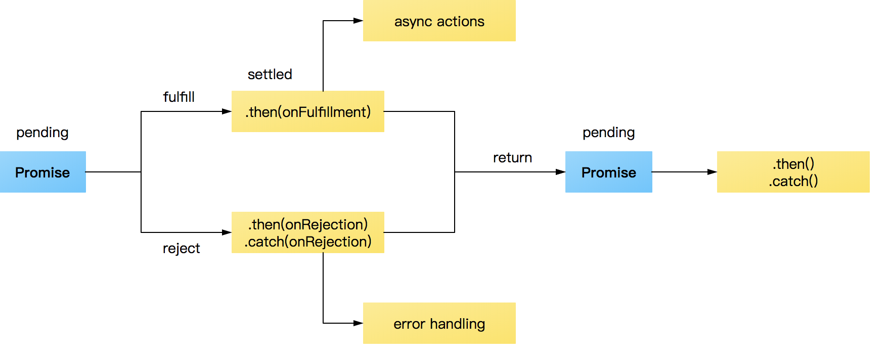
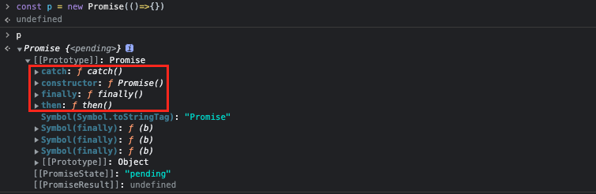

# Promise
[AJAX]:/Browser/ajax


## 說明
`Promise` 物件代表一個即將完成或失敗的 **非同步** 操作，它是一個建構式。
- [AJAX] 是一種資料不刷新頁面的技術名稱，而 `Promise` 是 `Javascript` 專門用來處理 **非同步行為** 的語法。
- `async` 、 `await` 可以讓 **非同步** 語法，更容易管理與理解順序，讓它看起來像「同步」
:::tip
`Javascript` 是阻塞性的語言，一次只能做一件事，為了避免阻塞，遇到 **非同步** 事件時，會最後再來處理 ([Event loop](/Javascript/eventLoop))。
:::

## 生命週期
每個 `Promise` 都會經過 `pending` 狀態，在 `pending` 後分別會有成功時走向的的 `fulfill` ，及失敗時的 `reject` ，並透過 `.then()` 在成功時接著處理資料，或是以 `.catch()` 做失敗時的應對，當然！不論是哪一條路，也可以再 `return` 一個新的 `Promise` 延續處理。

- 擱置（pending）：初始狀態，不是 fulfilled 與 rejected。
- 實現（fulfilled）：表示操作成功地完成。
- 拒絕（rejected）：表示操作失敗了。

## 使用
### 語法
```js
new Promise( /* 執行函式 */ (resolve, reject) => {...} )
```

### 建立 `Promise`
  - `resolve` 如果 **成功** 執行
  - `reject` 如果 **失敗** 執行
```js
const p = new Promise((resolve, reject) => {
  resolve('如果成功執行')
  // reject('如果失敗執行')
}) 
```
:::tip
成功、失敗只能擇一回傳，因為回傳就代表 `Promise` 結束。
:::

:::warning 變數、函式建立 Promise 的差別
```js
const getData = new Promise((resolve, reject) => {...})
```
```js
const getData = () => new Promise((resolve, reject) => {...})
```
`變數` 建立的 `Promise` 會立即執行，而 `函式` 當 **呼叫** 函式時，才會執行這個 `Promise`
```js
// 當建立的時候，就會馬上執行
const getData = new Promise((resolve, reject) => {
    setTimeout(()=>{
        console.log(123)
        resolve(123)
    }, 1000)
})

// 123
```
:::

**Promise 原型的方法**

透過 `new` 建立的 `Promise` 實體，會繼承以下這些方法。
- **`then()`** ： `promise` 結果為 `resolve` (解決) 會執行的回調。
- **`catch()`** ：`promise` 結果為 `reject` (拒絕) 會執行的回調。
- **`finally()`** 在 `promise` 不論 解決 或失敗，都會執行的最終回調。



### 後續處理 .then()
`Promise` 的執行結果，可以使用 `then` 來接下，而這個函式裡面，有兩個參數：
```js
p.then(/* 成功執行 */(resolve) => {}, /*失敗執行*/(reject)=>{})
```
- 成功執行
- 失敗執行 (這是在 `.then()` 內執行，也可以另用 `.catch()` 接下且執行)

### 失敗處理 .catch()
`Promise` 的執行結果，也可以使用 `.catch()` 來接下 **失敗** 的處理方式。
```js
p.catch((error)) => {...})
```
:::tip
這個部分，跟 `.then()` 的第二參數函式一樣。
:::

### 結束處理 .finally()
`Promise` 最終的回調執行，不管是否成功。
```js
p.finally(()=>{ console.log('Promise 結束') })
```

### 依序執行
`.then()` 除了可以做 `Promise` 後續的處理，也可以回傳以 **鍵式** 的向下傳遞 `參數` 或另一個 `Promise`。

```js
const fun1 = () => new Promise((resolve, reject)=>{
 resolve('Resolve Done1')
 // reject('Reject1!!')
})

const fun2 = () => new Promise((resolve, reject)=>{
  // resolve('Resolve Done2')
  reject('Reject2!!')
})

const fun3 = () => new Promise((resolve, reject)=>{
  resolve('Resolve Done3')
  // reject('Reject3!!')
})
		
const fun4 = () => new Promise((resolve, reject)=>{
  // resolve('Resolve Done4')
  reject('Reject4!!')
})
```
```js {3-10,19-26}
fun1()
// 執行 fun1()
.then((resolve)=>{
  console.log(resolve)
  // 回傳 fun2 給下一個 then 接
  return fun2()
},(err) => {
  console.log(err)
  return fun2()
})
// 執行 fun2()
.then((resolve)=>{
  console.log(resolve)
  return fun3()
}, (err)=> {
  console.log(err)
  return fun3()
})
// 執行 fun3()
.then((resolve)=>{
  console.log(resolve)
  return fun4()
}, (err)=> {
  console.log(err)
  return fun4()
})
// 執行 fun4()
.then((resolve)=>{
  console.log(resolve)
}, (err)=> {
  console.log(err)
})
```

### async await 類同步化執行
如果你覺得常常要 `.then()` 接來接去非常麻煩，可以使用 ES7 的 `async` 、 `await`，這可以大大提升代碼的可讀性，也可以讓你使用起來像是「同步」一樣。
```js {8,10}
const getDataAPI = () => new Promise((resolve, reject) => {
  setTimeout(() => {
    let data = { id: 1, name: 'John' }
    resolve(data)
  }, 2000) 
})

const getData = async() => {
  try{
    const res = await getDataAPI()
    console.log(res)
  }catch(error){
    console.error(error)
  }
}

getData() // { id: 1, name: 'John' }
```

## 同時執行多個 Promise Promise.all()
### 語法
在陣列裡面放入， `promise` 的實例(如果你的實例是使用函式，就要加上 `()`)
```js
Promise.all([ `fun1, fun2, fun3` ])
```
**操作**
```js
const task1 = () => new Promise((resolve, reject) => {
  setTimeout(resolve('task1'), 100);
});
const task2 = () => new Promise((resolve, reject) => {
  setTimeout(resolve('task2'), 100);
});
const task3 = () => new Promise((resolve, reject) => {
  setTimeout(resolve('task3'), 100);
});

Promise.all([
  task1(),
  task2(),
  task3(),
]).then(values => {
  console.log(values) // ["task1", "task2", "task3"]
})
```
### 解說
如果 `Promise.all` 裡面的執行全部都是 `resolve` ，就會在 `.then()` 成功的函式(第一參數)，回傳一個包含所有結果的陣列。 

### 失敗優先
當陣列中的實例，只要任何一個實例是被拒絕的 `reject` ，則這個 `Promise.all` 會立刻拒絕執行，**也不會吐成功 (resolve) 的實例響應**，只會吐 `reject` 的項目。
```js
const task1 = () => new Promise((resolve, reject) => {
  setTimeout(resolve('task1'), 100);
});
const task2 = () => new Promise((resolve, reject) => {
  setTimeout(reject('reject => task2'), 100);
});
const task3 = () => new Promise((resolve, reject) => {
  setTimeout(resolve('task3'), 100);
  });

Promise.all([
  task1(),
  task2(),
  task3(),
]).then(values => {
  console.log(values)
}, err => {console.error(err)})

// reject => task2
```


## 進階觀念
### 變數 與 函式 `Promise` 差別
- `變數` 當宣告同時會執行
- `函式` 執行函式的當下，才會開始執行 `promise` 的內容。
```js
const newPromise = new Promise((resolve, reject) => {
	setTimeout(()=>{
		console.log(`RESOLVE!`)
		resolve('RESOLVE!!')
	}, 3000)
})

// RESOLVE!
```

```js
const funPromise = () => new Promise((resolve, reject) => {
	setTimeout(()=>{
		console.log(`RESOLVE!`)
		resolve('RESOLVE!!')
	}, 3000)
})

funPromise() // RESOLVE!
```

### `.then` 可以接上一個 `.then` 的 `return` 值
```js
const fun1 = () => new Promise((resolve, reject) => {
	setTimeout(() => {
		resolve('fun1 resolve')
	}, 2000)
})

const fun2 = () => new Promise((resolve, reject) => {
	setTimeout(() => {
		resolve('fun2 resolve')
	}, 2000)
})


fun1().then((result) => {
    console.log(result)
    return 123
}).then(data => {
    console.log(data) // 123
})
```

## Reference
- [卡斯伯 - JavaScript Promise 全介紹
](https://wcc723.github.io/development/2020/02/16/all-new-promise/)
- [MDN](https://developer.mozilla.org/zh-TW/docs/Web/JavaScript/Reference/Global_Objects/Promise)
- [神q超人](https://medium.com/enjoy-life-enjoy-coding/javascript-%E5%BE%9Epromise%E9%96%8B%E5%A7%8B%E6%89%BF%E8%AB%BE%E7%9A%84%E9%83%A8%E8%90%BD%E6%A0%BC%E7%94%9F%E6%B4%BB-e20dba78732f)
- [Promises in JavaScript](https://tech-hour.com/promises-in-javascript?fbclid=IwAR0MT1kaN7D9l4FIkmDjeToqQOf7yzBYPLWu_VDPQaOPeQ_1imrm3ovWyXQ)
- [進階用法 .all (影片)](https://www.youtube.com/watch?v=NvzlOeRzKNE)
- [Promise.all()](https://developer.mozilla.org/zh-TW/docs/Web/JavaScript/Reference/Global_Objects/Promise/all)