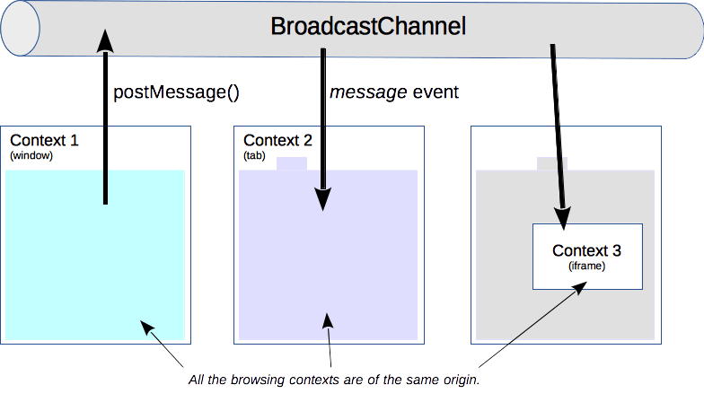

# Web APIs
紀錄少見但很有用的原生 Web API

## 頁面能見度 `document.visibilityState`
判斷目前網頁的能見度，當頁面 `可見` 或 `不可見` 時，做出相對應的事件。常見在頁面「不可見」時停止播放媒體，而「可見」後繼續播放，或其它應用方式。

- 監聽頁面能見度
  ```js
  document.addEventListener('visibilitychange', () => {
    // 當頁面能見度變化時
  })
  ```
- 判斷當前能見度
  ```js
  const visible = document.visibilityState
  console.log(visible) 
  ```
  - 可見 `visible`
  - 不可見 `hidden`
    - 最小化視窗
    - 切換桌面
    - 切換頁籤

:::details Demo
**html**
```html
<video id="video" controls>
  <source src="http://commondatastorage.googleapis.com/gtv-videos-bucket/sample/VolkswagenGTIReview.mp4" type="video/mp4" />
</video>
```

**script**
```js
const videoEl = document.querySelector('video')

document.addEventListener('visibilitychange', () => {
  const documentVisible = document.visibilityState

  if(documentVisible === 'hidden') {JQ
    console.log(`目前不可見 (${new Date()})`)
    videoEl.pause()
  }
  else if(documentVisible === 'visible') {
    console.log(`目前可見 (${new Date()})`)
    videoEl.play()
  }
})
```
:::

## 分享功能 `navigator.share`
Web Share API 的 `navigator.share()` 是一個 `promise` 方法，可以調用來分享網頁、連結、數據...。


:::info 👇 試試看
<button id="share-button" style="border: 1px solid lightblue; padding: .1rem 1rem; border-radius: 4px; display: flex; align-items: center; ">
  <svg xmlns="http://www.w3.org/2000/svg" width="16" height="16" fill="currentColor" class="bi bi-share" viewBox="0 0 16 16">
    <path d="M13.5 1a1.5 1.5 0 1 0 0 3 1.5 1.5 0 0 0 0-3zM11 2.5a2.5 2.5 0 1 1 .603 1.628l-6.718 3.12a2.499 2.499 0 0 1 0 1.504l6.718 3.12a2.5 2.5 0 1 1-.488.876l-6.718-3.12a2.5 2.5 0 1 1 0-3.256l6.718-3.12A2.5 2.5 0 0 1 11 2.5zm-8.5 4a1.5 1.5 0 1 0 0 3 1.5 1.5 0 0 0 0-3zm11 5.5a1.5 1.5 0 1 0 0 3 1.5 1.5 0 0 0 0-3z"/>
  </svg>
  <span style="margin-left: .4rem; ">分享頁面</span>
</button>
<p>手機端取消分享信息: {{ result }}</p>

<script>
  export default {
    data: () => ({
      shareData: {},
      result: ''
    }),

    mounted() {
      document.querySelector('#share-button').addEventListener('click', () => this.sharePage(this.shareData))
      this.shareData =  {
        title: 'docs99 Web Share API 分享功能',
        url: location.href,
        text: '這是來自 docs99 的 navigator.share 功能的分享內文。'
      }
    },

    methods: {
      async sharePage(shareData) {
        try {
          await navigator.share(shareData)
        } catch(errors) {
          if(errors.message === 'Abort due to cancellation of share.') {
            this.result = errors
            return false
          }
          alert(errors)
        }
      }
    }
  }
</script>

:::details Demo
**html**
```html
<button id="share-button" style="border: 1px solid lightblue; padding: .1rem 1rem; border-radius: 4px; display: flex; align-items: center; ">
  <svg xmlns="http://www.w3.org/2000/svg" width="16" height="16" fill="currentColor" class="bi bi-share" viewBox="0 0 16 16">
    <path d="M13.5 1a1.5 1.5 0 1 0 0 3 1.5 1.5 0 0 0 0-3zM11 2.5a2.5 2.5 0 1 1 .603 1.628l-6.718 3.12a2.499 2.499 0 0 1 0 1.504l6.718 3.12a2.5 2.5 0 1 1-.488.876l-6.718-3.12a2.5 2.5 0 1 1 0-3.256l6.718-3.12A2.5 2.5 0 0 1 11 2.5zm-8.5 4a1.5 1.5 0 1 0 0 3 1.5 1.5 0 0 0 0-3zm11 5.5a1.5 1.5 0 1 0 0 3 1.5 1.5 0 0 0 0-3z"/>
  </svg>
  <span style="margin-left: .4rem; ">分享頁面</span>
</button>
```

**javascript**
```js {18-28}
<script>
  export default {
    data: () => ({
      shareData: {},
      result: ''
    }),

    mounted() {
      document.querySelector('#share-button').addEventListener('click', () => this.sharePage(this.shareData))
      this.shareData =  {
        title: 'docs99 Web Share API 分享功能',
        url: location.href,
        text: '這是來自 docs99 的 navigator.share 功能的分享內文。'
      }
    },

    methods: {
      async sharePage(shareData) {
        try {
          await navigator.share(shareData)
        } catch(errors) {
          if(errors.message === 'Abort due to cancellation of share.') {
            this.result = errors
            return false
          }
          alert(errors)
        }
      }
    }
  }
</script>
```
:::

### 使用限制
- 操作 url 必須為 `https`
- 必須是使用 UI 互動 (比如: 點擊) 來執行事件，不可以直接調用!
- 目前還是有 [瀏覽器支援度](https://caniuse.com/web-share) 問題
  - 目前手機端 (chrome / edge / safari) 都是沒有問題
  - web chrome 會發生問題

### 特別注意
在手機端操作 `navigator.share` 若「取消分享」，會進到 `catch`，這是要特別處理，不然會跟不能操作的錯誤一樣走 `catch` 方法。

若「取消分享」 `errors.message` 為 `Abort due to cancellation of share.`，可以使用這個來判斷。

:::details Demo
```js {5-8}
async sharePage(shareData) {
  try {
    await navigator.share(shareData)
  } catch(errors) {
    if(errors.message === 'Abort due to cancellation of share.') {
      this.result = errors
      return false
    }
    alert(errors)
  }
}
```
:::

:::warning 注意
**這個方法必須是使用 UI 互動 (比如: 點擊) 來執行事件，不可以直接調用!**
:::

## 廣播頻道 `BroadcastChannel`
:::tip 簡單說
  `BroadcastChannel` 就是一個共用的頻道，只要有訂閱，大家都可以在上面「接收資料」與「傳送資料」。
:::



[圖片出處](https://developer.mozilla.org/zh-CN/docs/Web/API/Broadcast_Channel_API)

同一個網域下，透過訂閱「相同」 的頻道，可以在不同的 `視窗`、 `頁籤` 、 `iframe` 與頻道雙向互動 「接收頻道資料」、「傳送資料」到頻道上。想要一次跟多個頁面溝通，可以使用這個方法。

### 建立廣播
以 `new BroadcastChannel` 來建立一個實例，方法內寫入建立頻道的名稱 (字串)；而這個實例就是與頻道互動的實體。

```js
const channel = new BroadcastChannel('custom_channel_name')
```

:::tip 
建立一樣的頻道名稱實例，就可以在相同頻道互動。
:::
### 監聽廣播信息
頻道實例以 `.onmessage` 方法，寫入當頻道有傳送信息時執行的事件 (除了自已傳送之外)。

```js
channel.onmessage = (e) => {
  // 當 channel 傳送資料時執行
  console.log(e.data)
}
```
:::warning 注意
若有停止監聽頻道，需要再重新監聽頻道
:::

### 關閉廣播監聽
頻道實例以 `.close()` 方法，可以終止與頻道的互動，無法收到頻道傳送的資料，也無法對頻道傳送資料。

```js
channel.close()
```

:::warning 注意
若執行 `.close()` 再對頻道傳資料，就會報錯!

:::

### Demo

<iframe src="https://vd9b0k.csb.app/page1.html"
     style="width:100%; height:170px; border:0; border-radius: 4px; overflow:hidden;"
     title="hardcore-sammet-vd9b0k"
     allow="accelerometer; ambient-light-sensor; camera; encrypted-media; geolocation; gyroscope; hid; microphone; midi; payment; usb; vr; xr-spatial-tracking"
     sandbox="allow-forms allow-modals allow-popups allow-presentation allow-same-origin allow-scripts"
></iframe>

  :::details code
  **html**
  ```html
  <h1>Pae1</h1>
  <button>來自 Page1 的廣播</button>
  <p>廣播信息: <span id="result"></span></p>
  ```

  **Javascript**
  ```js
  const channel = new BroadcastChannel('custom_channel_name')

  const buttonEl = document.querySelector('button').addEventListener('click', () => {
    channel.postMessage('這是來自 Page1 的廣播')
  })

  channel.onmessage = (e) => {
    console.log(e.data)
    document.querySelector('#result').textContent = e.data
  }
  ```
  :::

<iframe src="https://vd9b0k.csb.app/page2.html"
     style="width:100%; height:170px; border:0; border-radius: 4px; overflow:hidden;"
     title="hardcore-sammet-vd9b0k"
     allow="accelerometer; ambient-light-sensor; camera; encrypted-media; geolocation; gyroscope; hid; microphone; midi; payment; usb; vr; xr-spatial-tracking"
     sandbox="allow-forms allow-modals allow-popups allow-presentation allow-same-origin allow-scripts"
></iframe>

  :::details code
  **html**
  ```html
  <h1>Page2</h1>
  <button id="channel-post-message">傳送 Page2 廣播</button>
  <button id="close-channel">停止廣播</button>
  <button id="connect-channel">接通廣播</button>

  <p>廣播信息: <span id="result"></span></p>
  ```

  **Javascript**
  ```js
  let channel

  const channelConnect = () => {
    channel = new BroadcastChannel('custom_channel_name')
    channel.onmessage = (e) => {
      document.querySelector('#result').textContent = e.data
      console.log(`由頻道收到的信息: ${e.data}`)
    }
  }

  channelConnect()

  document.querySelector('#channel-post-message').addEventListener('click', () => {
    channel.postMessage('這是來自 Page2 的廣播')
  })

  document.querySelector('#close-channel').addEventListener('click', () => {
    console.log('停止監聽廣播')
    document.querySelector('#result').textContent = ''
    channel.close()
  })

  document.querySelector('#connect-channel').addEventListener('click', () => {
    channelConnect()
    console.log('開始監聽廣播')
  })
  ```
  :::

<iframe src="https://vd9b0k.csb.app/page3.html"
  style="width:100%; height:170px; border:0; border-radius: 4px; overflow:hidden;"
  title="hardcore-sammet-vd9b0k"
  allow="accelerometer; ambient-light-sensor; camera; encrypted-media; geolocation; gyroscope; hid; microphone; midi; payment; usb; vr; xr-spatial-tracking"
   sandbox="allow-forms allow-modals allow-popups allow-presentation allow-same-origin allow-scripts"
></iframe>

  :::details code
  **html**
  ```html
  <h1>Page3</h1>
  <button>傳送 Page3 廣播</button>
  <p>廣播信息: <span id="result"></span></p>
  ```

  **Javascript**
  ```js
  const channel = new BroadcastChannel('custom_channel_name')
  channel.onmessage = (e) => {
    document.querySelector('#result').textContent = e.data
    console.log(e.data)
  }
  const buttonEl = document.querySelector('button').addEventListener('click', () => {
    channel.postMessage('這是來自 Page3 的廣播')
  })
  ```
  :::

## Reference
- Page Visibility 
  - [Page Visibility API 教程 @阮一峰](http://www.ruanyifeng.com/blog/2018/10/page_visibility_api.html)
- navigator.share
  - [navigator.share 支援度](https://caniuse.com/web-share)
  - [navigator.share NDM](https://developer.mozilla.org/en-US/docs/Web/API/Navigator/share)
  - [[教學] Web Share API - Navigator.share() 介紹](https://shubo.io/web-share-api/)
- 
  - [Broadcast Channel API MDN](https://developer.mozilla.org/zh-CN/docs/Web/API/Broadcast_Channel_API)
- [那些被忽略但很好用的 Web API](https://ithelp.ithome.com.tw/users/20125431/ironman/4836)
- [JavaScript APIs You Don’t Know About](https://www.smashingmagazine.com/2022/09/javascript-api-guide/#page-visibility-api)