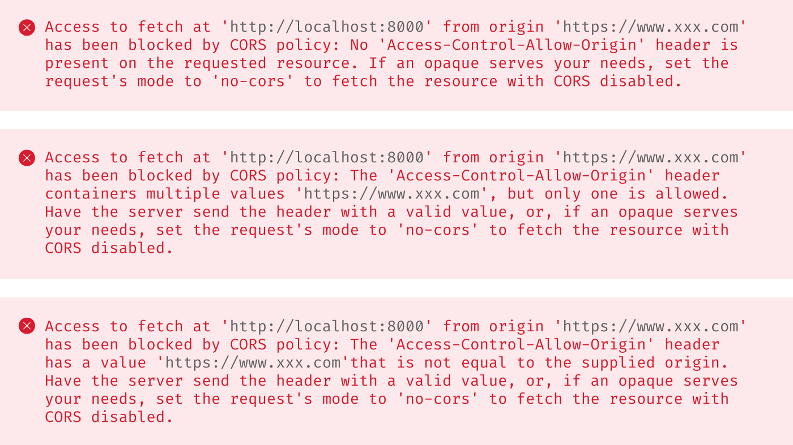
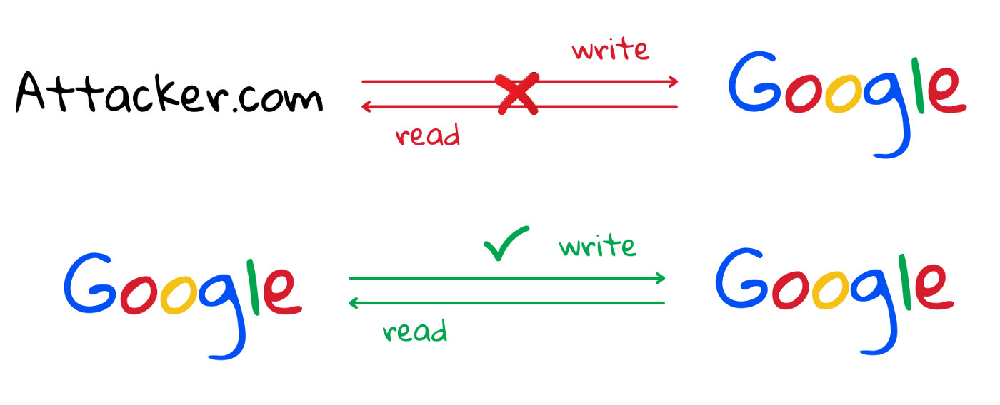

# CORS 與 同源政策

## 說明
基於網站安全的「同源政策」原則，網站只能存取自已網站的資源，當對他網進行存取，就會發生「CORS」警示，想要存取需要特定的設置。

> [圖片出處](https://medium.com/starbugs/%E5%BC%84%E6%87%82%E5%90%8C%E6%BA%90%E6%94%BF%E7%AD%96-same-origin-policy-%E8%88%87%E8%B7%A8%E7%B6%B2%E5%9F%9F-cors-e2e5c1a53a19)

## 解決方式
- **服務端** 

  「標頭」 `Access-Control-Allow-Origin` 加入合法「網域」。

- **開發階段**

  可以使用「代理服務器」去存取。 (`服務端` 對 `服務端` 是允許行為)。

## 同源政策 same-origin policy
基於網站的安全性，網站只可以存取自已的資源，「跨網站」存取是會被拒絕的。

> [圖片出處](https://medium.com/starbugs/%E5%BC%84%E6%87%82%E5%90%8C%E6%BA%90%E6%94%BF%E7%AD%96-same-origin-policy-%E8%88%87%E8%B7%A8%E7%B6%B2%E5%9F%9F-cors-e2e5c1a53a19)
### 同源定義:

對照網址: [`http://store.company.com/dir/page.html`](http://store.company.com/dir/page.html)

| URL | 同源 | 原因 |
| --- | --- | --- |
| `http://store.company.com/dir2/other.html` |  ✅  |  |
| `http://store.company.com/dir/inner/another.html` |  ✅  |  |
| `https://store.company.com/secure.html` |  ⛔  | 協定不同 |
| `http://store.company.com:81/dir/etc.html` |  ⛔  | 埠號不同 |
| `http://news.company.com/dir/other.html` |  ⛔  | 主機位置不同 |
> 「 `Cookie` 的來源定義與上面不同。」

### 允許「CORS」存取的方式:

- `` 圖片
- `<video>` 媒體
- `<object>` `<embed>` 嵌入外部資源
- `@font-face` 字型 (部分不支援)
- `<frame>` `<iframe>` 內嵌資源
## Reference
- [簡單弄懂同源政策 (Same Origin Policy) 與跨網域 (CORS)](https://medium.com/starbugs/%E5%BC%84%E6%87%82%E5%90%8C%E6%BA%90%E6%94%BF%E7%AD%96-same-origin-policy-%E8%88%87%E8%B7%A8%E7%B6%B2%E5%9F%9F-cors-e2e5c1a53a19)
- [Content Security Policy (CSP) - 幫你網站列白名單吧](https://medium.com/hannah-lin/content-security-policy-csp-%E5%B9%AB%E4%BD%A0%E7%B6%B2%E7%AB%99%E5%88%97%E7%99%BD%E5%90%8D%E5%96%AE%E5%90%A7-df38c990f63c)
- [CORS in 100 Seconds](https://www.youtube.com/watch?v=4KHiSt0oLJ0)
- [Learn CORS In 6 Minutes](https://www.youtube.com/watch?v=PNtFSVU-YTI)
- [同源政策 (Same-origin policy) - Web 安全 | MDN](https://developer.mozilla.org/zh-TW/docs/Web/Security/Same-origin_policy)
- [跨來源資源共用（CORS） - HTTP | MDN](https://developer.mozilla.org/zh-TW/docs/Web/HTTP/CORS)