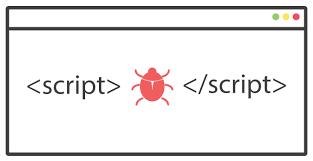

# XSS 跨站腳本攻擊

:::tip 簡單說
當網站讀取時，執行了攻擊者的「惡意程式碼」。
:::

## 說明
XSS (Cross-site scripting) 主要是在輸入框，透過規避字元規則讓原本是「字串」的內容，輸入了可以被執行的 `Javascript` 惡意程式碼。
常見有三種類型:
- Stored XSS 儲存型     ★★★★★
- Reflected XSS 反射型  ★★☆☆☆
- DOM Based XSS DOM型 ★★★☆☆

## Stored XSS 儲存型

<input style="width: 300px; padding: 5px 30px" placeholder="" />

讀取網站時，執行了「被儲存」在 `服務端` 資料庫的惡意程式碼。
例如: 論壇留言版中成功輸入  `` 且保存到資料庫，當網站被讀取顯示留言內容時，就會被執行這段程式碼。

### 🛡 預防方式
- 透過編碼 `Encode` 再輸出
- 過濾敏感字元 (有機會被繞過)

:::tip 技巧
可以使用 ``，來測試 XSS 防範。
:::

## Reflected XSS 反射型

<input disabled style="width: 500px; padding: 5px 10px" placeholder="https://www.example.com?name=" />

將 `script` 藏在 URL 網址中，當 `GET` 讀取網址時，被執行惡意程式碼。這樣的 URL 看起來很可疑，所以通常是把 URL 再透過 encode 變成 
`https://www.example.com?name=%3Cscript%3Ealert%28%27%E9%80%99%E6%98%AF%E6%83%A1%E6%84%8F%E7%A8%8B%E5%BC%8F%27%29%3C%2Fscript%3E`

## DOM Based XSS DOM型
常見在 `客戶端` (前端) 直接寫入 HTML (`innerHTML`) ，將惡意程式碼也寫入到網頁上，所執行的攻擊，可能會將用戶的 `cookie` 資料傳送到攻擊者的網站上。例如攻擊者可以放入一個被隱藏看不見的 ``，不過該 img 的 src 放的是一個「攜帶 cookie 資訊的請求」，如此一來攻擊者的伺服器就可以拿到被攻擊者的 cookie 了。

### 🛡 預防方式
盡量避免直接寫入 HTML，非不得已也要是可以信任的來源。

## Reference

<iframe width="560" height="315" src="https://www.youtube.com/embed/EoaDgUgS6QA" title="YouTube video player" frameborder="0" allow="accelerometer; autoplay; clipboard-write; encrypted-media; gyroscope; picture-in-picture" allowfullscreen></iframe>

- [身為 Web 工程師，你一定要知道的幾個 Web 資訊安全議題](https://medium.com/starbugs/%E8%BA%AB%E7%82%BA-web-%E5%B7%A5%E7%A8%8B%E5%B8%AB-%E4%BD%A0%E4%B8%80%E5%AE%9A%E8%A6%81%E7%9F%A5%E9%81%93%E7%9A%84%E5%B9%BE%E5%80%8B-web-%E8%B3%87%E8%A8%8A%E5%AE%89%E5%85%A8%E8%AD%B0%E9%A1%8C-29b8a4af6e13)

- [【網頁安全】給網頁開發新人的 XSS 攻擊 介紹與防範](https://forum.gamer.com.tw/Co.php?bsn=60292&sn=11267)

- [淺談 DOM Clobbering 的原理及應用](https://blog.techbridge.cc/2021/01/23/dom-clobbering/)

- [HTML5 Security Cheatsheet](https://html5sec.org/)

- [『 Day 9 』Web Security - A7 . Cross-Site Scripting (XSS) - 上篇 - iT 邦幫忙::一起幫忙解決難題，拯救 IT 人的一天](https://ithelp.ithome.com.tw/articles/10218476)

- [[XSS 1] 從攻擊自己網站學 XSS (Cross-Site Scripting)](https://medium.com/hannah-lin/%E5%BE%9E%E6%94%BB%E6%93%8A%E8%87%AA%E5%B7%B1%E7%B6%B2%E7%AB%99%E5%AD%B8-xss-cross-site-scripting-%E5%8E%9F%E7%90%86%E7%AF%87-fec3d1864e42)

- [透過XSS取得localstorage和cookie上的資料](https://blog.yyisyou.tw/3da8aedb/?fbclid=IwAR3BfsDOtgWYnJAHbZp7qkSbyTybGQte29hy9jZeqrfRn1iKQJZKps7svyA)
- [零基礎資安系列（二）-認識 XSS（Cross-Site Scripting）](https://tech-blog.cymetrics.io/posts/jo/zerobased-cross-site-scripting/)